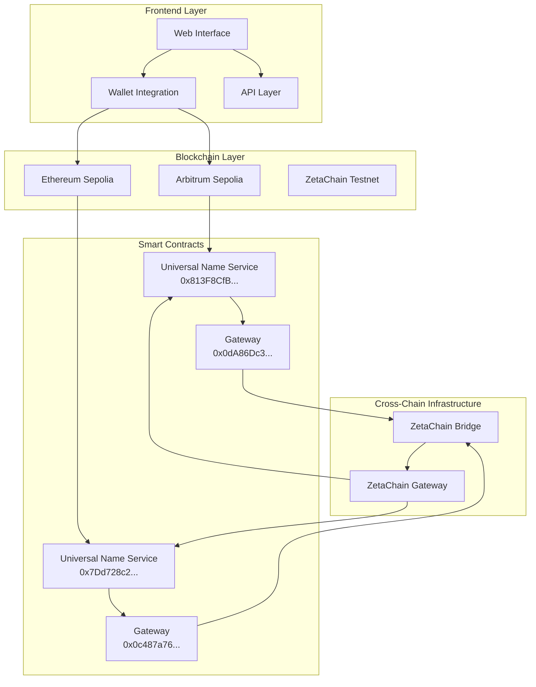
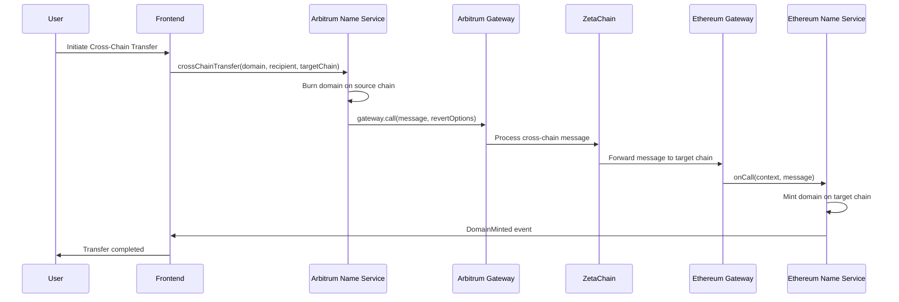
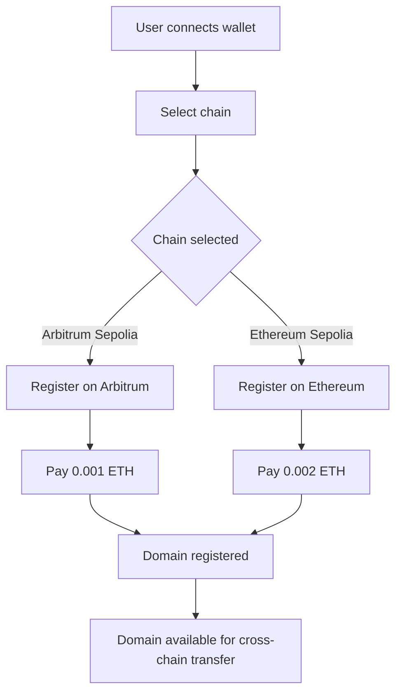
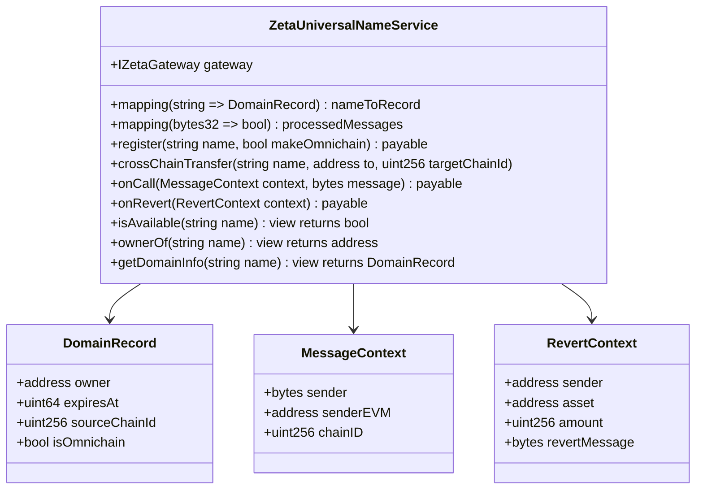
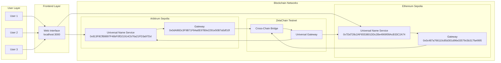
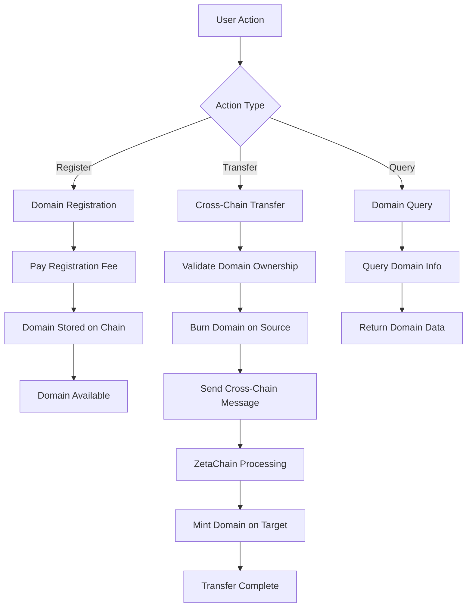

# ZetaChain Universal Name Service - System Architecture

## System Overview

The ZetaChain Universal Name Service is a cross-chain domain name service that allows users to register, transfer, and manage domain names across multiple blockchain networks using ZetaChain's Universal App pattern.

## Architecture Diagrams

### 1. System Architecture Overview

### 2. Cross-Chain Transfer Flow

### 3. Domain Registration Flow

### 4. Smart Contract Architecture

### 5. Network Topology

### 6. Data Flow Diagram

## Key Components

### Frontend Layer
- **Web Interface**: React-based UI for domain management
- **Wallet Integration**: MetaMask and other wallet support
- **Cross-Chain UI**: Interface for cross-chain transfers

### Smart Contract Layer
- **Universal Name Service**: Main contract for domain management
- **Gateway Integration**: ZetaChain Gateway for cross-chain communication
- **Event System**: Real-time updates for domain operations

### Cross-Chain Infrastructure
- **ZetaChain Bridge**: Handles cross-chain message passing
- **Gateway Contracts**: Interface between chains and ZetaChain
- **Message Processing**: Secure cross-chain communication

## Security Features

1. **Domain Ownership Validation**: Only domain owners can transfer
2. **Cross-Chain Message Validation**: Prevents replay attacks
3. **Gateway Authentication**: Only authorized gateways can mint domains
4. **Gas Optimization**: Efficient cross-chain operations

## Performance Characteristics

- **Registration Time**: ~15-30 seconds
- **Cross-Chain Transfer**: 2-5 minutes
- **Query Response**: <1 second
- **Gas Costs**: Optimized for efficiency

## Supported Networks

- **Arbitrum Sepolia**: Primary network (0.001 ETH registration)
- **Ethereum Sepolia**: Secondary network (0.002 ETH registration)
- **ZetaChain Testnet**: Cross-chain infrastructure
- **Future**: BSC Testnet, Polygon Mumbai (planned)
